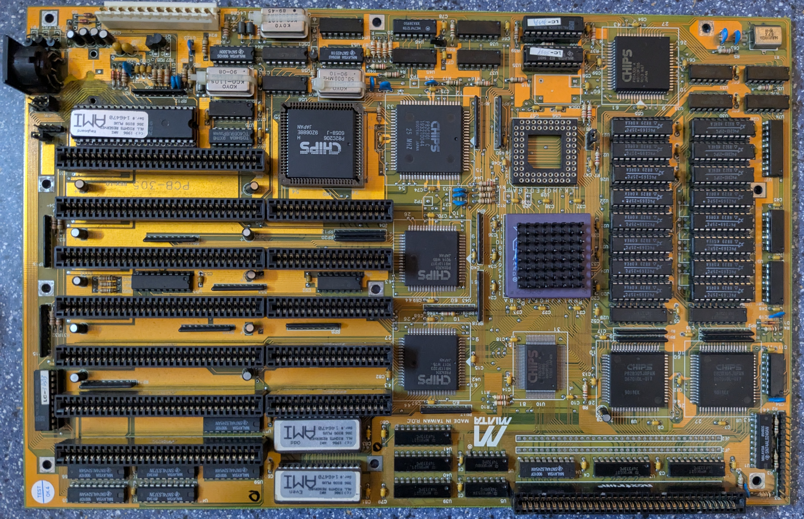
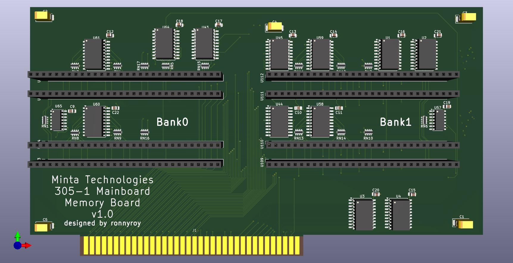

# Minta 386 memory board

This is a reverse engineered memory board for the Minta Technologies PCB-305 Mainboard.  
https://theretroweb.com/motherboards/s/minta-technologies-co-pcb-305  
  
I bought this board a while ago missing it's proprietary memory board with the plan to reverse engineer the memory board.   
The memory card was designed with sipp memory in mind as i have a lot of sipp modules, but the spacing also allows for simm sockets to be installed.
 
It can accomodate up to 8 1MB modules with the slot being wired to theoretically support up to 16MB.  
The first PCB revision contains a fault with the parity bit lines being swapped. This is fixed in the provided files.
  
